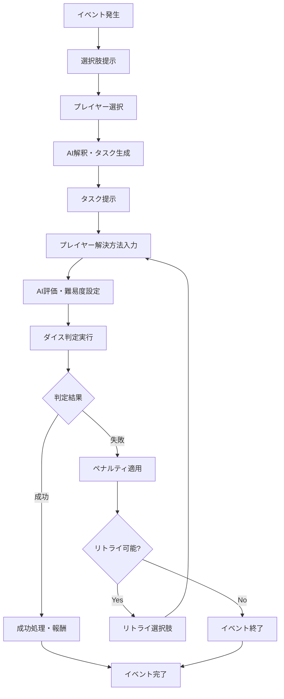

# インタラクティブイベントシステム設計書

## 1. システム概要

### 目的
プレイヤーの選択に基づいてAIが動的にタスクを生成し、対話を通じて難易度を調整し、ダイス判定による結果処理を行うリアルタイムイベントシステム

### 核心機能
- **動的選択肢生成**: イベントに応じた選択肢の提示
- **AI解釈・タスク化**: プレイヤー選択のAI解釈とタスク生成
- **対話型解決方法**: プレイヤーとAIのチャット形式での問題解決
- **動的難易度調整**: AIによるダイス難易度の自動設定
- **ペナルティ・リトライシステム**: 失敗時の適切なペナルティとリトライ機会

## 2. フロー設計

### 基本フロー


### ステート管理
- **WAITING_FOR_CHOICE**: 選択肢待ち
- **PROCESSING_CHOICE**: AI解釈中
- **WAITING_FOR_SOLUTION**: 解決方法入力待ち
- **CALCULATING_DIFFICULTY**: 難易度計算中
- **DICE_ROLLING**: ダイス判定中
- **PROCESSING_RESULT**: 結果処理中
- **WAITING_FOR_RETRY**: リトライ選択待ち
- **COMPLETED**: イベント完了

## 3. 技術アーキテクチャ

### コンポーネント設計
```
InteractiveEventManager (メインコンテナ)
├── EventChoicePanel (選択肢表示)
├── TaskPresentationPanel (タスク提示)
├── SolutionInputPanel (解決方法入力)
├── DifficultyDisplayPanel (難易度表示)
├── DiceRollPanel (ダイス判定)
├── ResultProcessingPanel (結果処理)
└── RetryOptionsPanel (リトライ選択)
```

### バックエンドサービス
```
InteractiveEventService
├── choiceInterpretation() - 選択肢解釈
├── taskGeneration() - タスク生成
├── difficultyCalculation() - 難易度計算
├── resultEvaluation() - 結果評価
└── penaltyApplication() - ペナルティ適用
```

### AI統合
- **既存aiServiceの拡張**
- **新prompt追加**:
  - `getChoiceInterpretationPrompt()`
  - `getTaskGenerationPrompt()`
  - `getDifficultyCalculationPrompt()`
  - `getResultNarrationPrompt()`

## 4. データ構造設計

### 型定義 (TypeScript)

#### 基本イベント構造
```typescript
interface InteractiveEventSession {
  id: ID;
  sessionId: ID;
  eventId: ID;
  playerId: ID;
  state: InteractiveEventState;
  currentStep: EventStep;
  timeline: EventStepHistory[];
  metadata: EventMetadata;
}

interface EventChoice {
  id: ID;
  text: string;
  description: string;
  category: 'action' | 'dialogue' | 'investigation' | 'combat' | 'social';
  consequences: ChoiceConsequence[];
  requirements?: ChoiceRequirement[];
}

interface AITaskDefinition {
  id: ID;
  choiceId: ID;
  interpretation: string;
  objective: string;
  approach: string[];
  constraints: string[];
  successCriteria: string[];
  estimatedDifficulty: DifficultyLevel;
}
```

#### ダイス・ペナルティシステム
```typescript
interface DynamicDifficultySettings {
  baseTargetNumber: number;
  modifiers: DifficultyModifier[];
  rollType: 'd20' | '2d10' | '3d6' | 'custom';
  criticalSuccess: number;
  criticalFailure: number;
  retryPenalty: number;
}

interface PenaltyEffect {
  type: 'hp_loss' | 'mp_loss' | 'status_effect' | 'item_loss' | 'time_loss' | 'reputation_loss';
  amount: number;
  description: string;
  duration?: number;
  reversible: boolean;
}

interface RetryOption {
  id: ID;
  description: string;
  penaltyReduction: number;
  costModifier: number;
  availableAttempts: number;
  requirements?: string[];
}
```

#### フロー管理
```typescript
interface EventStepHistory {
  step: EventStep;
  timestamp: DateTime;
  data: any;
  aiResponse?: string;
  playerInput?: string;
  diceResult?: DiceRollResult;
  penalties?: PenaltyEffect[];
}

interface EventMetadata {
  startTime: DateTime;
  totalAttempts: number;
  currentAttempt: number;
  maxAttempts: number;
  accumulatedPenalties: PenaltyEffect[];
  experienceEarned: number;
  storyProgression: string[];
}
```

## 5. UX設計

### UI原則
- **明確なフロー表示**: 現在のステップと進行状況の可視化
- **リアルタイムフィードバック**: AI処理中のローディング表示
- **選択肢の明確化**: 各選択肢の潜在的結果の示唆
- **ペナルティの透明性**: ペナルティ内容と影響の明確な表示
- **リトライの柔軟性**: リトライ条件と制限の明示

### レスポンシブ設計
- **デスクトップ**: 横並びパネル配置
- **タブレット**: 縦積みレイアウト
- **モバイル**: フルスクリーンモーダル

## 6. パフォーマンス考慮

### AI呼び出し最適化
- **非同期処理**: UI反応性の確保
- **キャッシュ機能**: 類似選択肢の結果キャッシュ
- **タイムアウト処理**: AI応答遅延時の代替処理

### 状態管理
- **局所的状態**: イベント固有データのローカル管理
- **グローバル状態**: キャラクターステータスの統合管理
- **永続化**: 重要な進行状況の自動保存

## 7. セキュリティ・エラーハンドリング

### 入力検証
- **プレイヤー入力**: XSS防止、長さ制限
- **AI出力**: 不適切コンテンツフィルタリング
- **ダイス結果**: 改ざん防止

### エラー回復
- **AI障害時**: フォールバック難易度設定
- **ネットワーク障害**: ローカル状態保持
- **データ破損**: 部分復旧機能

## 8. 実装優先順位

### フェーズ1: 基盤実装
1. 型定義の拡張
2. 基本的なステート管理
3. 簡単な選択肢システム

### フェーズ2: AI統合
1. AIサービス拡張
2. タスク生成機能
3. 難易度計算システム

### フェーズ3: 完全なUX
1. 完全なUIコンポーネント
2. ダイス・ペナルティシステム
3. リトライ機能

### フェーズ4: 最適化
1. パフォーマンス改善
2. エラーハンドリング強化
3. テスト・デバッグ

## 9. 成功指標

### 技術指標
- **応答時間**: AI処理 < 3秒
- **成功率**: エラー率 < 5%
- **UX指標**: フロー完了率 > 90%

### ゲーム体験指標
- **エンゲージメント**: 平均イベント時間
- **プレイヤー満足度**: リトライ率の適切な範囲
- **ナラティブ品質**: AI生成テキストの評価

---

この設計に基づいて段階的に実装を進めていきます。まずはフェーズ1の型定義から開始します。