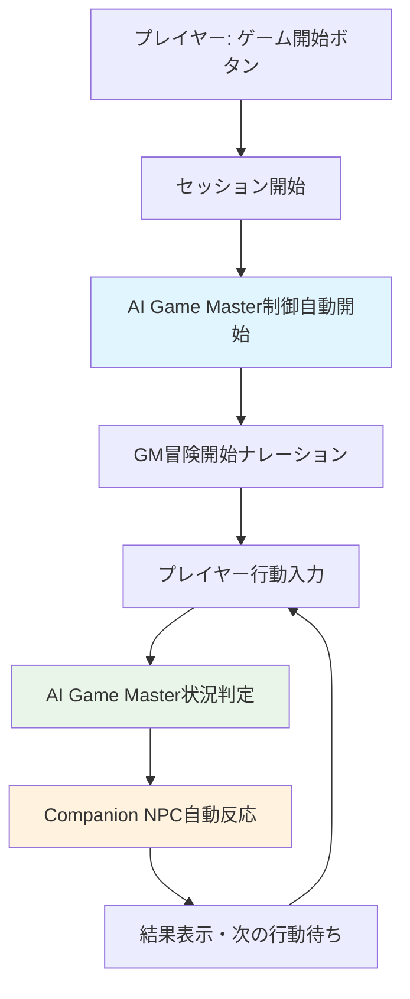

# AI Agent可視化・制御システム要件定義

## 📊 概要

TRPGセッション中のAI意思決定プロセスを可視化し、**必要最小限の制御機能**を提供するシステムの要件定義。

## 🎯 基本要件

### 前提条件
- 既存AI実装は完成度が高く実用可能
- ゲームマスターagent・キャラクターagentは動作済み
- マルチプレイヤー環境でagentがプレイヤーの代理操作を実行

### 目標
1. **AI決定過程の透明性確保**
2. **エネミー行動の最適度調整**
3. **キャラクター行動基準の可視化**
4. **AIリクエストログによるデバッグ支援**

---

## 🎮 1. ゲームマスターAgent可視化・制御

### 1.1 エネミー行動戦術調整

#### 📱 画面設計

**画面名**: `GMAgentControlPanel`
**配置**: TRPGセッション画面内のサイドパネル（開発者モード）

```typescript
interface GMControlPanelProps {
  sessionId: string;
  enemyTactics: EnemyTacticsLevel;
  onTacticsChange: (tactics: EnemyTacticsLevel) => void;
}

type TacticsLevel = 'basic' | 'strategic' | 'cunning';
type FocusType = 'damage' | 'control' | 'survival';

interface EnemyTacticsLevel {
  tacticsLevel: TacticsLevel;    // 戦術レベル
  primaryFocus: FocusType;       // 主要行動方針
  teamwork: boolean;             // チーム連携
}
```

**UI構成**:
```markdown
┌─ GM Agent Control Panel ─────────────────┐
│ 🧠 Enemy Tactics                         │
│ ┌─────────────────────────────────────┐   │
│ │ Tactics Level:                       │   │
│ │ ○ Basic    ● Strategic  ○ Cunning   │   │
│ │                                     │   │
│ │ Primary Focus:                      │   │
│ │ ○ Damage   ● Control   ○ Survival   │   │
│ │                                     │   │
│ │ Team Coordination: [✓] Enabled     │   │
│ └─────────────────────────────────────┘   │
│                                           │
│ 📊 Current AI Decision                   │
│ ┌─────────────────────────────────────┐   │
│ │ Last Action: Goblin casts Web        │   │
│ │ Reasoning: Control focus - disable   │   │
│ │ strongest party member first         │   │
│ │ Applied Setting: Strategic/Control   │   │
│ └─────────────────────────────────────┘   │
│                                           │
│ 🔄 [Apply Changes] [Reset to Default]    │
└───────────────────────────────────────────┘
```

#### 📡 API設計

```typescript
// GET /api/gm-agent/tactics-settings/:sessionId
interface GMTacticsResponse {
  sessionId: string;
  currentSettings: EnemyTacticsLevel;
  recentDecisions: AIDecisionLog[];
}

// PUT /api/gm-agent/tactics-settings/:sessionId
interface UpdateTacticsRequest {
  settings: Partial<EnemyTacticsLevel>;
  applyImmediately: boolean;
}

// GET /api/gm-agent/decision-log/:sessionId
interface AIDecisionLog {
  id: string;
  timestamp: string;
  decisionType: 'enemy_action' | 'enemy_targeting' | 'enemy_coordination';
  context: any;
  reasoning: string;
  appliedTactics: string;
}
```

---

## 🤖 2. キャラクターAgent設定・可視化

### 2.1 行動優先と性格設定

#### 📱 画面設計

**画面名**: `CharacterAIPanel`

```markdown
┌─ Character AI Settings ──────────────────┐
│ 👥 AI-Controlled Characters              │
│ ┌─────────────────────────────────────┐   │
│ │ [Agent] Warrior (Tank)   [Settings]│   │
│ │ [Agent] Rogue (DPS)      [Settings]│   │
│ │ [Player] Mage (Healer)             │   │
│ └─────────────────────────────────────┘   │
│                                           │
│ ⚙️ Settings for: Warrior                 │
│ ┌─────────────────────────────────────┐   │
│ │ Action Priority:                     │   │
│ │ ● Attack Focus   ○ Healing Focus    │   │
│ │ ○ Support Focus  ○ Balanced         │   │
│ │                                     │   │
│ │ Personality:                        │   │
│ │ ● Aggressive  ○ Cautious  ○ Calm    │   │
│ │                                     │   │
│ │ Team Communication Style:           │   │
│ │ ● Direct      ○ Polite    ○ Casual  │   │
│ └─────────────────────────────────────┘   │
│                                           │
│ 📊 Last Action Analysis                  │
│ ┌─────────────────────────────────────┐   │
│ │ Action: "Let me take the front!"    │   │
│ │ Behavior: Charge at enemy orc       │   │
│ │ Reasoning: Attack focus + Aggressive │   │
│ │ personality = proactive engagement   │   │
│ └─────────────────────────────────────┘   │
│                                           │
│ 🔄 [Apply Changes] [Reset Character]     │
└───────────────────────────────────────────┘
```

#### 📡 API設計

```typescript
// GET /api/character-ai/settings/:sessionId
interface CharacterAISettings {
  characters: Array<{
    characterId: string;
    name: string;
    class: string;
    controlType: 'agent' | 'player';
    actionPriority: ActionPriority;
    personality: PersonalityType;
    communicationStyle: CommunicationStyle;
    lastAction?: ActionAnalysis;
  }>;
}

type ActionPriority = 'attack_focus' | 'healing_focus' | 'support_focus' | 'balanced';
type PersonalityType = 'aggressive' | 'cautious' | 'calm';
type CommunicationStyle = 'direct' | 'polite' | 'casual';

interface ActionAnalysis {
  dialogue: string;       // AI発話内容
  behavior: string;       // AI行動内容
  reasoning: string;      // 判断理由
  appliedSettings: string; // 適用設定
  timestamp: string;
}

// PUT /api/character-ai/settings/:characterId
interface UpdateCharacterAIRequest {
  actionPriority?: ActionPriority;
  personality?: PersonalityType;
  communicationStyle?: CommunicationStyle;
}
```

---

## 📊 3. 開発者ダッシュボード

### 3.1 AIリクエストログ画面

#### 📱 画面設計

**画面名**: `AIRequestLogsPage`
**パス**: `/dev/ai-logs`

```markdown
┌─ AI Request Logs ─────────────────────────────────────────────┐
│ 🔍 Filters: [Campaign ▼] [Date Range] [Errors Only]          │
│                                                               │
│ 📋 Request Log                                               │
│ ┌─────────────────────────────────────────────────────────┐   │
│ │ Time     │ Category      │ Provider │ Status │ Duration │   │
│ ├─────────────────────────────────────────────────────────┤   │
│ │ 15:23:45 │ Enemy AI      │ OpenAI   │ ✅    │ 1.2s     │   │
│ │ 15:23:12 │ Character AI  │ Claude   │ ✅    │ 0.9s     │   │
│ │ 15:22:56 │ NPC Dialog    │ Gemini   │ ❌    │ 5.1s     │   │
│ │ 15:22:34 │ Scenario Gen  │ OpenAI   │ ✅    │ 2.1s     │   │
│ └─────────────────────────────────────────────────────────┘   │
│                                                               │
│ 🔍 [View Details] [Export Log]                              │
└───────────────────────────────────────────────────────────────┘
```

#### 📱 詳細モーダル設計

```markdown
┌─ AI Request Details ─────────────────────────────────────────────┐
│ 📝 Request ID: req_1234567890                    [Close ✕]      │
│                                                                   │
│ ℹ️ Metadata                                                      │
│ ┌─────────────────────────────────────────────────────────────┐   │
│ │ Timestamp: 2024-01-15 15:23:45                              │   │
│ │ Provider: OpenAI GPT-4                                      │   │
│ │ Category: Enemy AI Decision                                 │   │
│ │ Processing Time: 1.2s                                       │   │
│ │ Status: Success                                             │   │
│ └─────────────────────────────────────────────────────────────┘   │
│                                                                   │
│ 📤 Prompt                                                        │
│ ┌─────────────────────────────────────────────────────────────┐   │
│ │ System: You are controlling enemy goblins in combat...      │   │
│ │                                                             │   │
│ │ User: Choose the best target for goblin attack...          │   │
│ │                                                             │   │
│ │ Context: {                                                  │   │
│ │   "enemies": ["Warrior", "Rogue", "Mage"],                 │   │
│ │   "optimization": {"strategic": 5}                         │   │
│ │ }                                                           │   │
│ └─────────────────────────────────────────────────────────────┘   │
│                                                                   │
│ 📥 Response                                                      │
│ ┌─────────────────────────────────────────────────────────────┐   │
│ │ Target: Rogue                                               │   │
│ │ Reasoning: Lowest HP, high damage threat to party          │   │
│ │ Applied optimization: Strategic thinking (5/10)            │   │
│ └─────────────────────────────────────────────────────────────┘   │
│                                                                   │
│ 🔄 [Copy Prompt] [Export Details]                              │
└───────────────────────────────────────────────────────────────────┘
```

#### 📡 API設計

```typescript
// GET /api/dev/ai-requests
interface AIRequestsQuery {
  campaignId?: string;
  startDate?: string;
  endDate?: string;
  hasError?: boolean;
  page?: number;
  limit?: number;
}

interface AIRequestsResponse {
  requests: AIRequestLogEntry[];
  total: number;
}

interface AIRequestLogEntry {
  id: string;
  timestamp: string;
  category: string;
  provider: string;
  model: string;
  status: 'success' | 'error';
  processingTime: number;
  error?: string;         // エラー時のみ
}

// GET /api/dev/ai-requests/:id
interface AIRequestDetailResponse {
  id: string;
  timestamp: string;
  category: string;
  provider: string;
  model: string;
  status: 'success' | 'error';
  processingTime: number;
  prompt: string;
  response?: string;      // 成功時のみ
  error?: string;         // エラー時のみ
  context: any;
}
```

---

## 🎯 3.5 実装反映箇所

### 3.5.1 **Mastra Agentへの設定反映** 

#### **Game Master Agent**: `/apps/proxy-server/src/mastra/agents/gameMaster.ts`

```typescript
// エネミー戦術設定を動的に注入
export const gameMasterAgent = new Agent({
  name: "TRPG Game Master Agent",
  instructions: `
あなたは熟練のTRPGゲームマスターです。

## 🎭 エネミー戦術制御
現在の戦術設定: {{tacticsLevel}} / {{primaryFocus}} / {{teamwork}}

### Basic Tactics (基本戦術)
- 単純で直接的な攻撃行動
- 個別行動中心、連携は最小限
- 「ゴブリンは最も近い敵を攻撃する」

### Strategic Tactics (戦術的思考)
- 弱点を狙った効果的な攻撃
- 状況を読んだ行動選択
- 「ゴブリンは回復役のクレリックを優先的に狙う」

### Cunning Tactics (狡猾戦術)
- 罠、妨害、心理戦を駆使
- 高度なチーム連携
- 「ゴブリンAが気を引き、ゴブリンBが後方から奇襲」

## 🎯 行動方針制御
### Damage Focus: 敵の撃破を最優先
### Control Focus: 敵の行動制限を重視
### Survival Focus: 自軍の生存を最優先
  `,
  tools: [...gameMasterTools, enemyTacticsControlTool]
});
```

#### **Companion Agent**: `/apps/proxy-server/src/mastra/agents/companionAgent.ts`

```typescript
// キャラクター設定を動的に注入
export const companionAgent = new Agent({
  name: "TRPG Companion Agent",
  instructions: `
あなたはTRPGのパーティメンバーです。

## 🎭 キャラクター設定
- 行動優先: {{actionPriority}}
- 性格: {{personality}}  
- コミュニケーションスタイル: {{communicationStyle}}

## 🎯 行動優先制御
### Attack Focus (攻撃優先)
- 敵への攻撃を積極的に選択
- 戦闘で主導権を取る行動
- 発話例: "こいつは僕がやる！"

### Healing Focus (回復優先)  
- 仲間の回復・サポートを重視
- 危険回避の提案が多い
- 発話例: "みんな、無理しないで"

### Support Focus (補助行動優先)
- 情報収集、調査、罠解除を重視
- 戦術的優位性を追求
- 発話例: "ちょっと待って、ここを調べてみよう"

## 💬 性格による発話制御
### Aggressive: 積極的、自信満々
### Cautious: 慎重、心配性
### Calm: 冷静、論理的
  `,
  tools: [...companionAgentTools, characterPersonalityTool]
});
```

### 3.5.2 **既存systemPrompts.tsへの統合**

#### `/apps/proxy-server/src/utils/systemPrompts.ts`

```typescript
export const systemPrompts = {
  // 既存プロンプトに設定注入機能を追加
  getEnemyActionPrompt(tactics: EnemyTacticsLevel): string {
    return `You are controlling enemy actions in a TRPG combat.

Current Tactics Settings:
- Level: ${tactics.tacticsLevel}
- Focus: ${tactics.primaryFocus} 
- Teamwork: ${tactics.teamwork ? 'Enabled' : 'Disabled'}

${this.getTacticsInstructions(tactics)}
    `;
  },

  getCharacterActionPrompt(settings: CharacterAISettings): string {
    return `You are playing as a party member character.

Character Settings:
- Action Priority: ${settings.actionPriority}
- Personality: ${settings.personality}
- Communication: ${settings.communicationStyle}

${this.getPersonalityInstructions(settings)}
    `;
  }
};
```

### 3.5.3 **リアルタイム設定注入**

#### **Mastra Agent呼び出し時**

```typescript
// GM Agent呼び出し時に戦術設定を注入
export async function callGameMasterAgent(
  playerMessage: string,
  tactics: EnemyTacticsLevel
) {
  const response = await gameMasterAgent.generate([{
    role: "user",
    content: `
現在の戦術設定:
- レベル: ${tactics.tacticsLevel}
- 方針: ${tactics.primaryFocus}
- 連携: ${tactics.teamwork}

プレイヤー行動: "${playerMessage}"

この設定に基づいて、エネミーの行動を決定してください。
    `
  }]);
  
  return response;
}

// Character Agent呼び出し時に性格設定を注入
export async function callCompanionAgent(
  playerMessage: string,
  settings: CharacterAISettings
) {
  const response = await companionAgent.generate([{
    role: "user", 
    content: `
キャラクター設定:
- 行動優先: ${settings.actionPriority}
- 性格: ${settings.personality}
- コミュニケーション: ${settings.communicationStyle}

状況: "${playerMessage}"

この設定に基づいて、キャラクターの行動と発話を決定してください。
    `
  }]);
  
  return response;
}
```

### 3.5.4 **新規ツール追加**

#### **エネミー戦術制御ツール**

```typescript
// /apps/proxy-server/src/mastra/tools/enemyTacticsControl.ts
export const enemyTacticsControlTool = createTool({
  id: "enemy-tactics-control",
  description: "エネミーの戦術レベルに基づいて行動を決定",
  inputSchema: z.object({
    tacticsLevel: z.enum(['basic', 'strategic', 'cunning']),
    primaryFocus: z.enum(['damage', 'control', 'survival']),
    teamwork: z.boolean(),
    currentSituation: z.string()
  }),
  outputSchema: z.object({
    enemyAction: z.string(),
    reasoning: z.string(),
    appliedTactics: z.string()
  }),
  execute: async ({ context }) => {
    // 戦術設定に基づく行動決定ロジック
    const { tacticsLevel, primaryFocus, teamwork } = context;
    
    if (tacticsLevel === 'basic') {
      return {
        enemyAction: "Attack nearest enemy",
        reasoning: "Basic tactics: Simple direct approach",
        appliedTactics: "Basic/Direct"
      };
    }
    // ... より複雑な戦術ロジック
  }
});
```

#### **キャラクター性格制御ツール**

```typescript
// /apps/proxy-server/src/mastra/tools/characterPersonality.ts
export const characterPersonalityTool = createTool({
  id: "character-personality",
  description: "キャラクターの性格設定に基づいて行動と発話を決定",
  inputSchema: z.object({
    actionPriority: z.enum(['attack_focus', 'healing_focus', 'support_focus', 'balanced']),
    personality: z.enum(['aggressive', 'cautious', 'calm']),
    communicationStyle: z.enum(['direct', 'polite', 'casual']),
    situation: z.string()
  }),
  outputSchema: z.object({
    dialogue: z.string(),
    action: z.string(),
    reasoning: z.string()
  }),
  execute: async ({ context }) => {
    // 性格設定に基づく行動決定ロジック
    const { actionPriority, personality, communicationStyle } = context;
    
    if (actionPriority === 'attack_focus' && personality === 'aggressive') {
      return {
        dialogue: "こいつは俺がやる！",
        action: "Charge at enemy",
        reasoning: "Attack priority + Aggressive personality"
      };
    }
    // ... より複雑な性格ロジック
  }
});
```

---

## 🎮 4. 新しいプレイ体験設計

### 4.1 シームレスAI Game Master制御

#### 📋 **現在の課題**
- 「ゲーム開始」と「AI制御開始」が分離されている
- プレイヤーが手動で「AI制御開始」ボタンを押す必要がある
- **AI TRPG Game Master**プロジェクトの本質と不整合

#### ✨ **新しい体験フロー**



#### 🎯 **設計原則**

1. **ワンクリック開始**: 「ゲーム開始」= AI GM制御開始
2. **イベント駆動**: ポーリングではなくプレイヤー行動をトリガー
3. **自然な流れ**: プレイヤー行動 → GM判定 → NPC反応のチェーン実行
4. **透明性**: AI判断過程の可視化（開発者モード）

### 4.2 イベント駆動AI実行システム

#### ⚡ **チェーン実行の流れ**

**従来（ポーリング方式）**:
```typescript
❌ 問題のある実装
setInterval(() => {
  // 30秒ごとに勝手にNPCが行動
  triggerAllAICharacterActions();
}, 30000);
```

**新方式（イベント駆動）**:
```typescript
✅ 改善された実装
const handlePlayerAction = async (playerAction: string) => {
  // 1. プレイヤー行動をチャットに表示
  await onSendMessage(playerAction, 'ic');
  
  // 2. AI Game Master が状況を判定・応答
  const gmResponse = await triggerGMResponse({
    playerAction,
    sessionContext: currentSessionState
  });
  
  // 3. Companion NPCが自然に反応
  const companionReactions = await triggerCompanionChain({
    playerAction,
    gmResponse,
    sessionContext: currentSessionState
  });
  
  // 4. 結果を統合してチャット表示
  await displayChainResults(gmResponse, companionReactions);
};
```

#### 🔗 **Mastra Agent Chain活用**

既存の`/api/mastra-agent/agent-chain`エンドポイントを活用:

```typescript
// Agent実行順序
interface AgentChainExecution {
  sequence: [
    'companionAgent',    // Companion NPCの反応
    'storyProgressAgent', // ストーリー進行判定
    'environmentAgent'   // 環境・状況変化
  ];
  triggerEvent: PlayerActionEvent;
  sessionContext: SessionState;
}

// 自然な実行例
PlayerAction: "洞窟の奥を調べる"
↓
CompanionAgent: "気をつけて！何か嫌な予感がする..."
↓  
StoryProgressAgent: "古い魔法陣を発見。文字が光り始める"
↓
EnvironmentAgent: "突然、洞窟が震動し、石が落下してくる"
```

### 4.3 プレイヤー体験シナリオ

#### 🎭 **体験例1: 探索シーン**

```
プレイヤー: [ゲーム開始ボタン]
↓
AI GM: "森の入り口に立つあなたたち。深い木々の間から不気味な音が聞こえる..."
↓
プレイヤー: "慎重に森に入る"
↓ (自動チェーン実行)
Companion(Rogue): "僕が先頭で罠をチェックします"
Companion(Warrior): "後方は任せろ！"
AI GM: "10分ほど歩くと、木に刻まれた古い印を発見する..."
```

#### 🎭 **体験例2: 戦闘シーン**

```
プレイヤー: "ゴブリンに火球を撃つ"
↓ (自動チェーン実行)
AI GM: "火球がゴブリンに命中！残りのゴブリンが怒り狂う"
Enemy AI: "ゴブリンAは魔法使いを狙って突進、ゴブリンBは援軍を呼ぶ"
Companion(Cleric): "回復の準備をします！"
AI GM: "戦況が激化してきた。次の行動をどうする？"
```

### 4.4 技術的実装要件

#### 🔧 **SessionInterface.tsx 統合**

```typescript
interface SessionInterface {
  // 既存のonStartSessionを拡張
  onStartSession: (config?: SessionDurationConfig) => Promise<void>;
}

// 実装
const handleStartSession = async (config) => {
  // 1. 従来のセッション開始
  await onStartSession(config);
  
  // 2. AI Game Master制御を自動開始
  await startAIGameMasterControl({
    autoChainExecution: true,
    eventDriven: true,
    pollingDisabled: true
  });
  
  // 3. 冒険開始のナレーション生成
  await triggerGMIntroduction();
};
```

#### ⚙️ **AI Control Panel 非表示化**

```typescript
// プレイヤーモードでは自動制御のため非表示
const showAIControlPanel = !isPlayerMode || isDeveloperMode;

{showAIControlPanel && (
  <AIControlPanel 
    sessionId={sessionId}
    characters={characters}
    sessionState={sessionState}
    autoStart={true}  // ゲーム開始時に自動開始
  />
)}
```

#### 🎯 **Event Chain API設計**

```typescript
// 新規APIエンドポイント
POST /api/ai-agent/trigger-chain

interface TriggerChainRequest {
  sessionId: string;
  triggerEvent: {
    type: 'player_action' | 'gm_event' | 'environment_change';
    content: string;
    characterId?: string;
  };
  chainConfig: {
    includeCompanions: boolean;
    includeEnemies: boolean;
    includeEnvironment: boolean;
  };
}

interface TriggerChainResponse {
  executionId: string;
  results: Array<{
    agentType: 'gm' | 'companion' | 'enemy';
    characterId?: string;
    response: string;
    reasoning: string;
    executionTime: number;
  }>;
  totalExecutionTime: number;
}
```

### 4.5 開発者モード制御機能

開発者は引き続き詳細制御が可能:

```typescript
// 開発者モード専用パネル
interface DeveloperControlPanel {
  // AI自動実行の一時停止
  pauseAutoChain: boolean;
  
  // 手動でチェーン実行
  manualTriggerChain: () => Promise<void>;
  
  // 個別Agent実行
  triggerSpecificAgent: (agentType: AgentType) => Promise<void>;
  
  // チェーン実行履歴
  chainExecutionLog: ChainExecution[];
}
```

---

## 🔧 5. 実装技術仕様

### 5.1 フロントエンド実装

#### React Components
```typescript
// 新規作成するコンポーネント
/apps/frontend/src/components/dev/
├── GMAgentControlPanel.tsx   // GM戦術調整（選択式）
├── CharacterAIPanel.tsx      // キャラクター設定・可視化
├── AIRequestLogsPage.tsx     // AIリクエストログ画面
└── shared/
    ├── TacticsSelector.tsx   // 戦術選択コンポーネント
    ├── PersonalitySelector.tsx // 性格選択コンポーネント
    └── AIDecisionDisplay.tsx  // AI判断表示
```

#### Hooks
```typescript
/apps/frontend/src/hooks/
├── useGMTacticsControl.ts   // GM戦術調整
├── useCharacterAISettings.ts // キャラクターAI設定管理
└── useAIRequestLogs.ts      // ログ取得
```

### 5.2 バックエンド実装

#### API Routes
```typescript
/apps/proxy-server/src/routes/dev/
├── gmTacticsControl.ts      // GM戦術制御API
├── characterAISettings.ts   // キャラクターAI設定API
└── aiRequestLogs.ts         // ログAPI
```

#### Services拡張
```typescript
/apps/proxy-server/src/services/
├── aiGameMasterService.ts   // エネミー戦術調整機能追加
└── aiCharacterService.ts    // 行動優先・性格設定機能追加
```

### 5.3 データベース拡張

```sql
-- 新規テーブル
CREATE TABLE ai_tactics_settings (
  id TEXT PRIMARY KEY,
  session_id TEXT NOT NULL,
  agent_type TEXT NOT NULL, -- 'gm' | 'character'
  settings TEXT NOT NULL,   -- JSON格式的选择项设置
  created_at TEXT NOT NULL,
  updated_at TEXT NOT NULL
);

-- 例: GM settings JSON
-- {
--   "tacticsLevel": "strategic",
--   "primaryFocus": "control", 
--   "teamwork": true
-- }

-- 例: Character settings JSON  
-- {
--   "actionPriority": "attack_focus",
--   "personality": "aggressive",
--   "communicationStyle": "direct"
-- }
```

---

## 🚀 6. 実装優先順位

### Phase 0: 新しいプレイ体験基盤（2週間）
1. ✅ **シームレスAI GM開始**: 「ゲーム開始」ボタンでAI Game Master制御自動開始
2. ✅ **イベント駆動システム**: ポーリング廃止、プレイヤー行動→Agent反応のチェーン実行
3. ✅ **Agent Chain API**: `/api/ai-agent/trigger-chain`エンドポイント実装
4. ✅ **SessionInterface統合**: 既存UIにシームレス統合
5. ✅ **プレイヤーモード最適化**: 自動制御でAI Control Panel非表示化

### Phase 1: AIリクエストログ（1週間）
1. ✅ **AIRequestLogsPage**: ログ閲覧機能
2. ✅ **詳細モーダル**: リクエスト・レスポンス詳細表示

### Phase 2: GM戦術制御システム（2週間）  
1. ✅ **GMTacticsControlPanel**: エネミー戦術選択UI（Basic/Strategic/Cunning）
2. ✅ **Focus設定**: Damage/Control/Survival選択
3. ✅ **AI決定過程表示**: 判断理由と適用戦術の透明化
4. ✅ **リアルタイム調整API**: 即座反映機能

### Phase 3: キャラクターAI設定・可視化（1週間）
1. ✅ **CharacterAIPanel**: 行動優先選択UI（Attack/Healing/Support/Balanced）
2. ✅ **性格設定**: Aggressive/Cautious/Calm選択
3. ✅ **コミュニケーションスタイル**: Direct/Polite/Casual選択
4. ✅ **行動分析表示**: 発話・行動・判断理由の表示

---

## 🎯 7. 成功指標

### 定量指標
- **ログ検索性能**: 検索・フィルタ応答時間 < 1秒
- **設定反映速度**: エネミー戦術・キャラクター設定の反映時間 < 2秒
- **設定変更頻度**: セッション中の調整回数 < 3回（直感的設定の証明）

### 定性指標
- **設定の直感性**: TRPGらしい選択肢で迷わずに設定可能
- **AI発話の自然性**: キャラクター性格設定による会話の向上
- **透明性**: AI判断理由の理解容易性
- **TRPGらしさ**: 数値ではなく感覚的な調整による体験向上

### 🎮 **TRPGらしさの評価ポイント**
- エネミーが「Basic→Strategic→Cunning」に変わることで体感できる難易度変化
- キャラクターの性格設定がPTメンバーとの会話に自然に反映
- 「攻撃優先」「回復優先」「補助行動優先」による明確な行動変化
- 状況に応じてAgentが適切に判断を変える柔軟性

---

## 📚 8. 関連ドキュメント

- [AI_agent機能.md](./AI_agent機能.md) - 既存AI機能の詳細
- [TRPGセッション_フロー.md](./TRPGセッション_フロー.md) - セッション全体の流れ
- [Mastra移行計画.md](./Mastra移行計画.md) - 次世代AI実装計画

---

*このドキュメントは**TRPGらしい直感的な設定**と**AI行動の透明性**を重視し、プレイヤーが自然にAI Agentと協力できる環境構築を目指しています。*