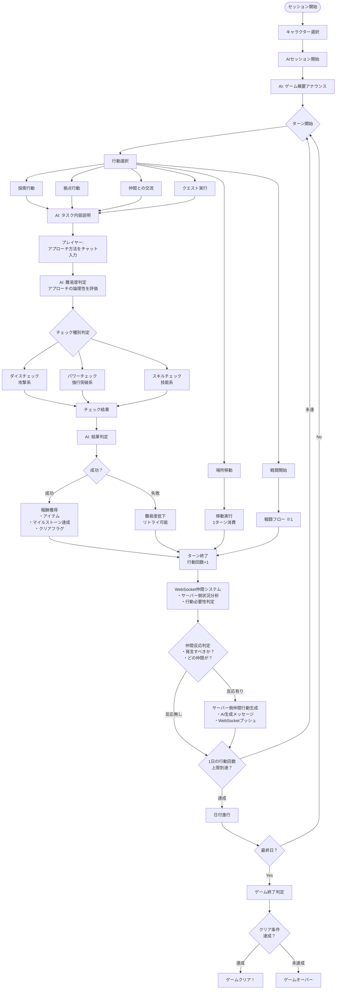
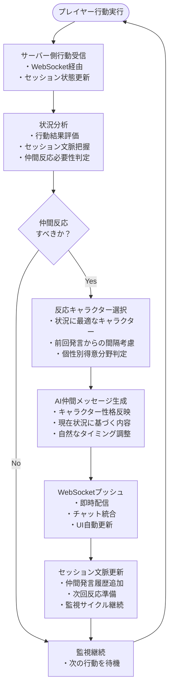

# TRPGセッション フロー

## 全体フロー図

## 詳細フロー説明

### 1. セッション開始フェーズ
1. **キャラクター選択**: プレイヤーが操作するキャラクターを選択
2. **AIセッション開始**: 「AIセッションを開始します」ボタンをクリック
3. **ゲーム概要アナウンス**: AIゲームマスターが世界観とシナリオを説明

### 2. 行動選択フェーズ
プレイヤーは以下の行動から選択：

#### a. 探索行動
- マイルストーンに設定されたイベントから選択
- 調査、追跡、偵察などの行動

#### b. 拠点行動
- 拠点タブに設定された施設での行動
- 買い物、休息、情報収集など

#### c. 仲間との交流
- パーティメンバーとのコミュニケーション
- 相談、作戦会議など

#### d. クエスト実行
- クエスト管理画面から選択
- メインクエスト、サブクエストの進行

#### e. 場所移動
- 現在地から別の場所へ移動
- 固定1ターン消費

#### f. 戦闘
- 「探索」タブが「戦闘」タブに切り替わる
- 詳細は戦闘フロー参照

### 3. タスク実行フェーズ
1. **タスク内容説明**: AIがタスクの詳細を説明
2. **アプローチ決定**: プレイヤーがチャットでアプローチ方法を入力
3. **難易度判定**: AIがアプローチの論理性を評価し、難易度を調整

### 4. チェック実行フェーズ
アプローチに応じて適切なチェックを実行：

- **ダイスチェック**: 攻撃や一般的な判定
- **パワーチェック**: 力技での突破
- **スキルチェック**: 特定技能を使用した判定

### 5. 結果処理フェーズ
- **成功時**: 
  - アイテム獲得
  - マイルストーン達成
  - クリアフラグ設定
  - 経験値獲得
  
- **失敗時**:
  - 難易度が低下してリトライ可能
  - 状況に応じたペナルティ

### 6. ターン管理・仲間自律行動
- 各行動で1ターン消費
- 1日あたりの行動回数制限あり（通常3回）
- **WebSocket仲間自律システム**の実行：

#### 6.1 サーバー側状況分析フェーズ
1. **行動結果分析**: プレイヤーの行動結果と現在状況を分析
2. **仲間反応判定**: 各仲間キャラクターが反応すべきかを判定
3. **個性別反応生成**: キャラクター性格に基づいたAI反応生成
4. **WebSocket配信**: 生成されたメッセージをリアルタイムでプッシュ

#### 6.2 リアルタイム配信フェーズ
1. **即時配信**: AI生成された仲間メッセージを即座にクライアントにプッシュ
2. **チャット統合**: WebSocketメッセージがチャットインターフェースに自動表示
3. **状況更新**: 仲間の行動に基づいて次のAI監視サイクル更新
4. **継続監視**: WebSocketを通じて継続的なセッション監視実行

#### 6.3 キャラクター職業別反応パターン
- **戦士**: 戦術的アドバイス、危険察知、仲間保護
- **魔法使い**: 知識提供、魔法的解決策、慎重な判断
- **盗賊**: 危険回避、効率的ルート、隠し要素発見

#### 6.4 状況適応システム
- **成功連続時**: 励まし、次の挑戦提案
- **失敗連続時**: 慰め、戦略変更提案
- **リスク高時**: 警告、安全策提案
- **探索長期化時**: 休息提案、モチベーション維持

### 7. ゲーム終了判定
最終日の最終ターンで以下を確認：
- キーアイテムの所持
- マイルストーンのクリア状況
- 特定イベントのクリアフラグ
- その他、キャンペーン設定で定義されたクリア条件

## WebSocket仲間自律行動システム（※1）

### WebSocketシステムの特徴

#### **リアルタイム応答メカニズム**
- **即時判定**: プレイヤー行動後、サーバー側で即座に反応判定
- **適切なタイミング**: 状況に応じた自然な反応タイミング
- **プッシュ配信**: WebSocketによる即時メッセージ配信
- **省エネ監視**: 必要時のみAI生成実行で効率的

#### **自然な会話流れ**
- **文脈保持**: セッション全体の文脈を踏まえた適切な反応
- **キャラクター一貫性**: 各仲間の性格・専門性を正確に反映
- **状況適応**: 現在の状況に最も適したキャラクターが発言
- **個性表現**: 戦士・魔法使い・盗賊の特色ある反応

#### **サーバー管理の利点**
- **集中管理**: セッション状態をサーバー側で一元管理
- **データ整合性**: WebSocketによる確実な状態同期
- **拡張性**: 新キャラクターや新機能の追加が容易
- **リアルタイム性**: 人間が操作しているような自然な反応速度

## 戦闘フロー（※2）

### 戦闘詳細
- **1ターンに1回行動**: 攻撃、アイテム使用、スキル使用、会話、逃走から選択
- **仲間の自律行動**: AIが状況に応じて最適な行動を選択
- **敵の行動**: 基本的にAIが制御、一部は事前設定された行動パターン

## NPC・エネミー配置
- **NPC**: 各拠点に配属（宿屋、道具屋、武器屋の店主など）
- **エネミー**: 
  - クエストで指定された固定配置
  - AIが自律的に動かすランダムエンカウント

## 特記事項

### 仲間自律行動システムの革新的特徴
- **WebSocket AI**: サーバー側で状況を判断し、リアルタイムで仲間が自然に反応
- **適応的発言**: 行動結果に応じて最も適切なキャラクターが適切なタイミングで発言
- **自然な会話**: AIエージェントが人間プレイヤーを代理操作している前提での自然な反応
- **個性表現**: 各キャラクターの職業・性格に応じた独自の反応パターン

### AIゲームマスターとの連携
- AIゲームマスターは常にプレイヤーの行動を監視し、適切な演出とフィードバックを提供
- 仲間システムとGMは独立して動作し、自然な多角的サポートを実現
- 難易度はプレイヤーのアプローチによって動的に調整される

### 技術的実装ポイント
- **WebSocket通信**: Socket.IOによる安定したリアルタイム通信
- **サーバー管理**: グローバルsocketService経由での統一的な仲間メッセージ管理
- **拡張性**: 新キャラクター・新反応パターンの追加が容易な設計
- **フォールト耐性**: WebSocket接続失敗時の適切なフォールバック機能