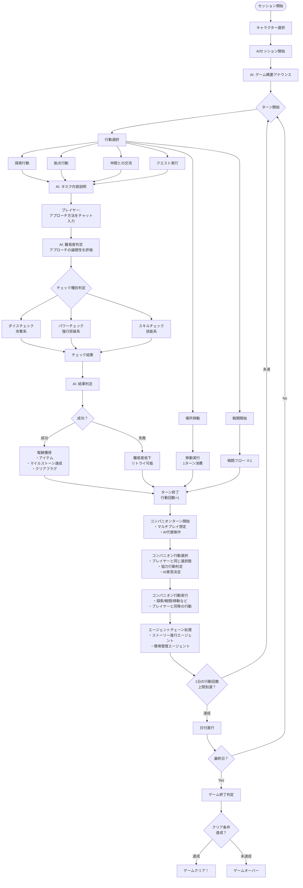
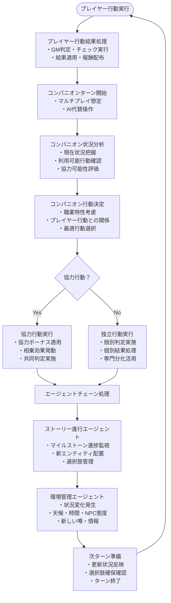
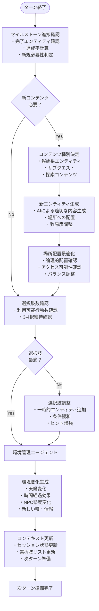
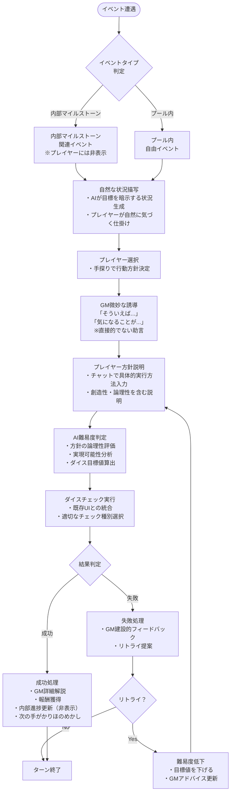
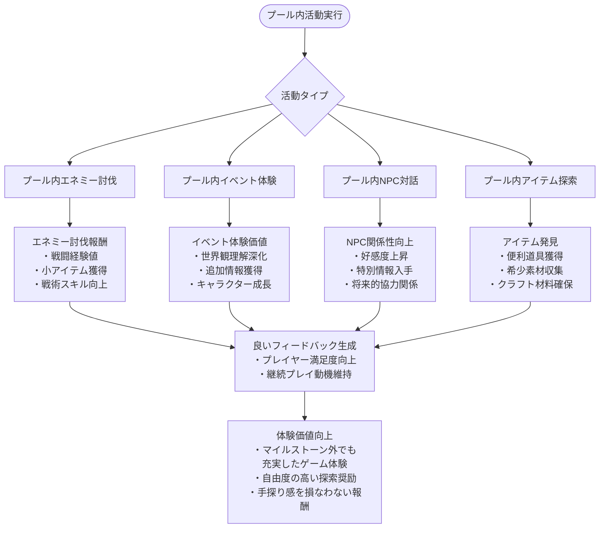

# TRPGセッション フロー

## 全体フロー図



## 詳細フロー説明

### 1. セッション開始フェーズ
1. **キャラクター選択**: プレイヤーが操作するキャラクターを選択
2. **セッション時間設定**: プレイ時間を選択
   - **短時間プレイ**: 3日間、1日3アクション、マイルストーン1個、約30分
     - 日単位分割: 朝・昼・夜（3つの時間帯）
   - **中時間プレイ**: 7日間、1日4アクション、マイルストーン3個、約70分
     - 日単位分割: 朝・昼・夕方・夜（4つの時間帯）
   - **長時間プレイ**: 11日間、1日4アクション、マイルストーン5個、約2時間
     - 日単位分割: 朝・昼・夕方・夜（4つの時間帯）
   - **カスタム**: 自由設定（1日3～4アクション選択可能、日単位分割数も選択可能）
3. **AIセッション開始**: 設定を確認して「セッション開始」ボタンをクリック
4. **プール・マイルストーン生成**: AIが以下をバッチ処理で生成
   - **エンティティプール生成**: テーマに適応したエネミー、イベント、NPC、アイテム、クエストプールを生成
   - **マイルストーン自動生成**: 基本3個程度のマイルストーンを以下のタイプから選択して生成
     - 特定のエネミーを倒す（テーマにより無効化：ほのぼの日常など）
     - 特定のイベントをクリア
     - 特定のNPCとの特定のコミュニケーションの実施
     - キーアイテムの取得
     - クエストクリア
   - **場所連携設定**: イベント・エネミーを適切な場所に配置
5. **ゲーム概要アナウンス**: AIゲームマスターが世界観とシナリオを説明

### 2. 行動選択フェーズ
プレイヤーは以下の行動から選択：

#### a. 探索行動
- **マイルストーン関連**: マイルストーンに設定されたイベント・エネミー・NPCとの遭遇
- **プール内探索**: プール内のエネミー討伐・イベント体験・NPCとの自由対話
- **場所別コンテンツ**: 現在地に配置されたイベント・エネミーの発見
- 調査、追跡、偵察などの行動

#### b. 拠点行動
- 拠点タブに設定された施設での行動
- 買い物、休息、情報収集など

#### c. 仲間との交流
- パーティメンバーとのコミュニケーション
- 相談、作戦会議など

#### d. クエスト実行
- クエスト管理画面から選択
- メインクエスト、サブクエストの進行

#### e. 場所移動
- 現在地から別の場所へ移動
- 固定1ターン消費

#### f. 戦闘
- 「探索」タブが「戦闘」タブに切り替わる
- 詳細は戦闘フロー参照

### 3. タスク実行フェーズ

#### 3.1 インタラクティブイベント実行フロー
1. **イベント選択肢表示**: AIが複数の行動選択肢を提示（何択か）
2. **選択肢選択**: プレイヤーが希望する行動を選択
3. **GMクリア方針問いかけ**: AIゲームマスターが「どのようにタスクをクリアしますか？」と質問
4. **クリア方針説明**: プレイヤーがチャットで具体的な実行方針を説明
5. **AI難易度判定**: プレイヤーの方針に基づきAIが難易度を算出
6. **ダイスチェック実行**: 既存のダイスチェックUIとの連携
7. **結果判定・GM解説**: 成功・失敗に応じたGMの詳細な結果説明

#### 3.2 リトライシステム
- **リトライ可能**: 失敗時は何度でもリトライ可能
- **段階的難易度低下**: リトライごとに難易度が下がる
- **フィードバック変化**: リトライ回数に応じたGMのアドバイス内容変化

#### 3.3 従来のタスク実行（非イベント）
1. **タスク内容説明**: AIがタスクの詳細を説明
2. **アプローチ決定**: プレイヤーがチャットでアプローチ方法を入力
3. **難易度判定**: AIがアプローチの論理性を評価し、難易度を調整

### 4. チェック実行フェーズ
アプローチに応じて適切なチェックを実行：

- **ダイスチェック**: 攻撃や一般的な判定
- **パワーチェック**: 力技での突破
- **スキルチェック**: 特定技能を使用した判定

### 5. 結果処理フェーズ

#### 5.1 マイルストーン関連活動の成功時
- **マイルストーン達成**: 対象マイルストーンの進捗更新・完了
- **キーアイテム獲得**: マイルストーン必須アイテムの入手
- **クリアフラグ設定**: 重要イベント・NPCコミュニケーション完了
- **経験値・報酬獲得**: マイルストーン価値に応じた大きな報酬

#### 5.2 プール内活動の成功時（マイルストーン外）
- **良いフィードバック提供**: マイルストーン進展はないが、プレイヤー体験を向上
- **サブ報酬獲得**: 小さなアイテム・経験値・情報の入手
- **NPCとの関係性向上**: 自由対話による好感度上昇
- **世界観の深掘り**: 追加の背景情報・ストーリー要素の発見

#### 5.3 失敗時の処理
- **難易度が低下してリトライ可能**: すべての活動でリトライ機能提供
- **建設的フィードバック**: 失敗理由の説明と改善提案
- **状況に応じたペナルティ**: 軽微なペナルティ（時間消費のみなど）

### 6. ターン管理・マルチプレイ対応コンパニオンシステム
- 各行動で1ターン消費
- 1日あたりの行動回数制限あり（日単位分割システム）：
  - **短時間プレイ**: 1日3アクション（朝・昼・夜の3つの時間帯）
  - **中時間プレイ**: 1日4アクション（朝・昼・夕方・夜の4つの時間帯）
  - **長時間プレイ**: 1日4アクション（朝・昼・夕方・夜の4つの時間帯）
  - **カスタム**: 3～4アクション選択可能（日単位分割数も選択可能）
- **マルチプレイ前提コンパニオンシステム**の実行：

#### 6.1 コンパニオン行動決定フェーズ
1. **行動選択**: プレイヤーと同じ選択肢（探索/戦闘/移動/拠点/交流）から選択
2. **協力判定**: プレイヤーと同じ行動を選択した場合の協力効果発動
3. **AI意思決定**: キャラクター性格・能力値・状況に基づく最適行動選択
4. **行動実行**: プレイヤーと同等の判定・チェック・結果処理

#### 6.2 エージェントチェーン処理フェーズ
1. **ストーリー進行エージェント**: マイルストーン進捗監視・新エンティティ配置
2. **環境管理エージェント**: 状況変化（天候・時間・NPC態度・噂）の発生
3. **選択肢管理**: 常に3-4択の行動選択肢を確保するための調整
4. **次ターン準備**: 更新された状況での次のターン開始準備

#### 6.3 コンパニオン職業別行動特性（マルチプレイ想定）
- **戦士**: 戦闘重視の行動選択、危険な場所の優先探索、仲間との協力戦闘
- **魔法使い**: 情報収集重視、慎重な探索、魔法的解決法の提案
- **盗賊**: 効率重視、隠し要素探索、リスク回避の行動選択

#### 6.4 協力行動システム
- **同一行動時**: プレイヤーとコンパニオンが同じ行動を選択時に協力ボーナス
- **補完行動時**: 異なる行動でも相乗効果が期待できる組み合わせを評価
- **専門分化**: 各キャラクターの得意分野を活かした自然な役割分担
- **マルチプレイ感**: 人間プレイヤー同士の協力と同等の体験を提供

### 7. ゲーム終了判定
最終日の最終ターンで以下を確認：
- キーアイテムの所持
- マイルストーンのクリア状況
- 特定イベントのクリアフラグ
- その他、キャンペーン設定で定義されたクリア条件

## マルチプレイ対応コンパニオンシステム（※1）



### マルチプレイ対応コンパニオンシステムの特徴

#### **マルチプレイ体験の再現**
- **同等行動権**: プレイヤーと同じ行動選択肢を持つ完全なパーティメンバー
- **協力行動**: プレイヤーと同じ行動選択時の協力ボーナス・相乗効果
- **専門分化**: 各キャラクターの職業特性を活かした自然な役割分担
- **人間代替**: マルチプレイ人数不足時の自然なAI代替操作

#### **エージェントチェーン連携**
- **ストーリー進行**: マイルストーン進捗に応じた動的なコンテンツ配置
- **環境管理**: 状況変化・天候・NPC態度・噂の自然な発生
- **選択肢維持**: 常に3-4択の行動選択肢を確保する動的調整
- **文脈保持**: セッション全体の流れを踏まえた一貫性のある体験

#### **技術的実装の利点**
- **ターン制統合**: 既存のターン制システムとの完全な互換性
- **状態同期**: WebSocketによる確実なマルチプレイ状態管理
- **拡張性**: 新キャラクター・新エージェント追加の容易さ
- **スケーラビリティ**: 実際のマルチプレイへの移行可能性

## 戦闘フロー（※2）


### 戦闘詳細
- **1ターンに1回行動**: 攻撃、アイテム使用、スキル使用、会話、逃走から選択
- **仲間の自律行動**: AIが状況に応じて最適な行動を選択
- **敵の行動**: 基本的にAIが制御、一部は事前設定された行動パターン

## NPC・エネミー配置
- **NPC**: 各拠点に配属（宿屋、道具屋、武器屋の店主など）
- **エネミー**: 
  - クエストで指定された固定配置
  - AIが自律的に動かすランダムエンカウント

## 特記事項

### マルチプレイ対応コンパニオンシステムの革新的特徴
- **真のマルチプレイ体験**: 人間プレイヤー同士の協力プレイと同等の体験を提供
- **完全なパーティメンバー**: プレイヤーと同じ行動権・判定権を持つ対等な存在
- **協力行動メカニズム**: 同一行動選択時の自然な協力ボーナス・相乗効果
- **エージェントチェーン**: ストーリー進行・環境管理エージェントとの連携による動的世界

### AIゲームマスターとの連携（手探り体験の演出責任者）
- **内部進捗監視**: マイルストーン進捗を内部で追跡し、プレイヤーには絶対に直接表示しない
- **自然な誘導**: 「そういえば村の人が...」「気になる話を聞いたのですが...」等の自然な手がかり提示
- **暗示的演出**: 進捗に応じて状況描写を変化させ、プレイヤーが自然に次の行動を思いつくよう誘導
- **手探り感維持**: 「○○を達成しました」ではなく「何か重要な発見をしたようです」等の曖昧な表現
- **仲間システムとの連携**: 仲間キャラクターを通じてさりげなくヒントを提供
- **動的難易度調整**: プレイヤーのアプローチと内部進捗状況に応じた適切な難易度設定

### 技術的実装ポイント
- **エージェントチェーン**: Mastraフレームワークによる協調型AIエージェント実装
- **ターン制統合**: 既存ターン制システムとの完全な互換性確保
- **状態同期**: WebSocketによるマルチプレイ状態管理とリアルタイム同期
- **動的コンテンツ**: ストーリー進行エージェントによる選択肢・エンティティの動的配置
- **環境システム**: 環境管理エージェントによる自然な世界状況変化
- **スケーラビリティ**: 実際のマルチプレイへの移行可能な設計

## エージェントチェーンシステム詳細フロー

### ストーリー進行エージェント動作フロー



### エージェント協調動作の特徴

#### **ストーリー進行エージェント**
- **役割**: マイルストーン進捗に応じた動的コンテンツ管理
- **動作タイミング**: 各ターン終了後、コンパニオン行動処理後
- **主要機能**: 
  - 進捗状況の監視・評価
  - 新エンティティの生成・配置
  - 選択肢数の維持（3-4択確保）
  - プレイヤー体験の最適化

#### **環境管理エージェント**
- **役割**: 世界状況の自然な変化管理
- **動作タイミング**: ストーリー進行エージェント処理後
- **主要機能**:
  - 天候・時間帯の変化
  - NPC態度・関係性の変化
  - 新しい噂・情報の発生
  - 世界の「生きている感」演出

#### **エージェント間連携の利点**
- **整合性確保**: 各エージェントが協調して一貫した世界観を維持
- **負荷分散**: 機能別分離により効率的な処理実行
- **拡張性**: 新エージェント追加時の既存システムへの影響最小化
- **品質向上**: 専門化による各機能の高品質化

## マイルストーン・プールシステム詳細フロー

### マイルストーン構造と紐付けシステム

#### マイルストーンの基本構造
各マイルストーンは以下の要素から構成される：

1. **複数エンティティ紐付け**（基本3個）
   - `targetEntityIds`: 達成に必要なエンティティのIDリスト
   - `targetDetails`: 各エンティティの詳細な達成条件
   - `requiredConditions`: 達成に必要な前提条件

2. **エンティティタイプ組み合わせ例**
   ```
   マイルストーン: "村の謎を解明せよ"
   └── エネミー討伐: "怪しい影を倒す" (enemy-001)
   └── イベントクリア: "古い手紙を調査" (event-003)  
   └── NPCコミュニケーション: "村長から真実を聞く" (npc-002)
   ```

3. **達成判定ロジック**
   - すべての紐付けエンティティが達成されたときにマイルストーン完了
   - 部分達成でも進捗率が更新される（33%, 66%, 100%）
   - エンティティの達成順序は問わない（柔軟な攻略順）

#### エンティティ個別達成報酬システム

**各エンティティは独立した報酬を持つ**
```
エネミー討伐 (enemy-001):
├── 即時報酬: 戦闘経験値 50 EXP
├── アイテム: 怪しい布切れ
└── 情報: "影の正体に関する手がかり"

イベントクリア (event-003):
├── 即時報酬: 調査経験値 30 EXP  
├── アイテム: 古い鍵
└── 情報: "村の過去に関する重要な記録"

NPCコミュニケーション (npc-002):
├── 即時報酬: 社交経験値 40 EXP
├── 関係性: 村長好感度 +20
└── 情報: "事件の真相と解決策"
```

**マイルストーン完了時の追加報酬**
- 全エンティティ達成後のボーナス報酬
- ストーリー進行報酬
- 特別アイテム・称号の獲得

### 場所ベース行動表示システム

#### TRPGセッション右サイドバー行動表示の仕組み

**重要**: この機能はTRPGセッション中の**右サイドバー**で動作します。左サイドバーはメイン機能用で、TRPGセッション中のみ右側に専用サイドバーが表示されます。

**場所紐付けデータ構造**
```typescript
interface LocationEntity {
  entityId: string;
  entityType: 'enemy' | 'event' | 'npc' | 'item' | 'quest';
  locationId: string;
  isAvailable: boolean;
  displayConditions: string[];
  actionLabel: string; // 右サイドバー表示用ラベル
}
```

**右サイドバー表示ロジック**
1. **現在地確認**: プレイヤーの現在位置を取得
2. **エンティティフィルタ**: 現在地に紐付くエンティティを抽出
3. **可用性チェック**: 表示条件・前提条件を確認
4. **行動ボタン生成**: 達成可能なエンティティを右サイドバー行動ボタンとして表示

**右サイドバー表示例（プレイヤー視点）**
```
📍 現在地: 古い村の中央広場

🗡️ 可能な行動:
├── 🔍 "影の痕跡を調査"
├── 💬 "村長と話す" 
├── ⚔️ "怪しい影と戦う" [夜のみ]
└── 🎯 "古い井戸を調べる"

💭 気になるもの:
├── ❓ "この村には何か秘密がありそうだ..."
├── ❓ "住民たちが何かを隠している様子"
└── ❓ "夜になると不気味な気配を感じる"
```

#### 動的コンテンツ更新（プレイヤーには非表示の内部処理）
- **時間帯による変化**: 朝/昼/夕方/夜で表示内容が変化
- **前提条件**: 他のエンティティ達成により解放される行動
- **イベント状態**: 一度達成したエンティティは表示から除外
- **内部進捗管理**: マイルストーン関連のエンティティを内部で追跡（プレイヤーには非表示）

#### 右サイドバーからのアクション実行フロー

**行動選択→実行の流れ**
1. **右サイドバー行動選択**: プレイヤーが利用可能な行動ボタンをクリック
2. **行動詳細表示**: 選択した行動の詳細情報をメイン画面に表示
3. **アプローチ入力**: プレイヤーがチャットで具体的なアプローチ方法を説明
4. **AI難易度判定**: アプローチの論理性・創造性に基づく難易度算出
5. **チェック実行**: ダイス・パワー・スキルチェックのいずれかを実行
6. **結果処理**: 成功時は報酬付与・マイルストーン進捗更新、失敗時はリトライ提案

**内部マイルストーン進捗管理（プレイヤーには非表示）**
- エンティティ達成時に内部でマイルストーン進捗を更新（バックエンドのみ）
- 進捗率の変化（33% → 66% → 100%）を内部で管理
- AIゲームマスターがそれとなく進捗をほのめかすメッセージを生成
- 完了したエンティティは右サイドバーから除外（理由は自然に演出）

#### エンティティ個別報酬システムの詳細実装

**即時報酬配布システム**
各エンティティ達成時に以下の即時報酬が配布されます：

```typescript
interface EntityReward {
  entityId: string;
  entityType: 'enemy' | 'event' | 'npc' | 'item' | 'quest';
  immediateRewards: {
    experience: number;           // 即時経験値
    items: PoolItem[];           // 獲得アイテム
    information: string[];        // 入手情報・手がかり
    relationships?: {             // NPC関係性（NPC系のみ）
      npcId: string;
      relationshipChange: number; // 好感度変化
    }[];
  };
  milestoneContribution: {
    milestoneId: string;
    progressContribution: number; // 33%, 66%, etc.
  }[];
}
```

**報酬配布タイミング（プレイヤー体験重視）**
1. **エンティティチェック成功時**: 即座に個別報酬を配布
2. **右サイドバー更新**: 完了したエンティティを自然に除外（「もう調べる必要がなさそうだ」等）
3. **内部進捗計算**: 該当マイルストーンの進捗率を内部で更新（非表示）
4. **AIゲームマスターヒント**: 進捗に応じてそれとなく次の手がかりを提示
5. **ボーナス報酬判定**: マイルストーン完了時は自然な流れで追加報酬を配布

**複数マイルストーン紐付けの処理**
- 1つのエンティティが複数のマイルストーンに紐付けられている場合
- 達成時にすべての関連マイルストーンの進捗が同時に更新される
- 各マイルストーンで異なる進捗貢献度を持つことが可能

### セッション開始時生成システムフロー（トップダウン設計）

```mermaid
flowchart TD
    SessionStart([「セッション開始！」押下]) --> ThemeAnalysis[Phase 1: 目標設計<br/>・キャンペーンテーマ分析<br/>・プレイ時間・難易度確認<br/>・許可エンティティタイプ決定]
    
    ThemeAnalysis --> MilestoneOutline[マイルストーン概要生成<br/>・基本3個のストーリー目標<br/>・「村の謎解明」「遺跡探索」等<br/>・抽象レベルでの目標設定]
    
    MilestoneOutline --> MilestoneRelation[マイルストーン関係性設定<br/>・独立型 vs 連鎖型<br/>・難易度グラデーション<br/>・プレイ時間配分]
    
    MilestoneRelation --> Phase2[Phase 2: コンテンツ生成]
    
    Phase2 --> EntityRequirement[マイルストーン必須エンティティ決定<br/>・各マイルストーンに3エンティティ<br/>・エネミー・イベント・NPC・アイテム・クエスト<br/>・テーマ制約適用]
    
    EntityRequirement --> CoreEntityGeneration[コアエンティティプール生成<br/>・マイルストーン必須: 9個<br/>・AIがテーマ適応生成<br/>・達成条件と報酬設定]
    
    CoreEntityGeneration --> AdditionalEntityGeneration[追加エンティティプール生成<br/>・自由探索用: 6個程度<br/>・世界観深化コンテンツ<br/>・サブ報酬系エンティティ]
    
    AdditionalEntityGeneration --> LocationGeneration[場所生成・配置最適化<br/>・エンティティに適した場所生成<br/>・論理的な場所間つながり<br/>・移動効率を考慮した配置]
    
    LocationGeneration --> Phase3[Phase 3: 最終調整]
    
    Phase3 --> MilestoneDetailization[マイルストーン詳細化<br/>・具体的エンティティIDとの紐付け<br/>・達成条件の具体化<br/>・進捗率配分決定]
    
    MilestoneDetailization --> BalanceAdjustment[バランス調整<br/>・難易度確認・調整<br/>・プレイ時間配分確認<br/>・エンティティ配置の論理性確認]
    
    BalanceAdjustment --> DatabaseCommit[データベース一括コミット<br/>・マイルストーンテーブル<br/>・エンティティプールテーブル<br/>・場所紐付けテーブル]
    
    DatabaseCommit --> GameReady[ゲーム開始準備完了<br/>・右サイドバー初期表示<br/>・AIゲームマスター初期化<br/>・セッション状態初期化]
```



### インタラクティブイベントシステムフロー（手探り体験重視）



### プール内活動フィードバックシステム



### 開発者モード管理フロー


### テーマ適応システム

#### テーマ別制約・特徴

**ほのぼの日常テーマ**
- ✅ **有効**: イベント、NPC対話、アイテム獲得、クエスト
- ❌ **無効**: エネミー討伐マイルストーン
- 🎯 **特化**: 料理、手芸、農業、友情、地域貢献系イベント

**ホラーミステリーテーマ**
- ✅ **有効**: 全マイルストーンタイプ対応
- 🎯 **特化**: 謎解き、証拠収集、真犯人発見、呪い解除

**クラシックファンタジーテーマ**
- ✅ **有効**: 全マイルストーンタイプ対応
- 🎯 **特化**: 魔王討伐、伝説武器獲得、古代遺跡探索

**SF宇宙冒険テーマ**
- ✅ **有効**: 全マイルストーンタイプ対応（エネミー=エイリアン等）
- 🎯 **特化**: 未知技術獲得、惑星探索、宇宙戦争