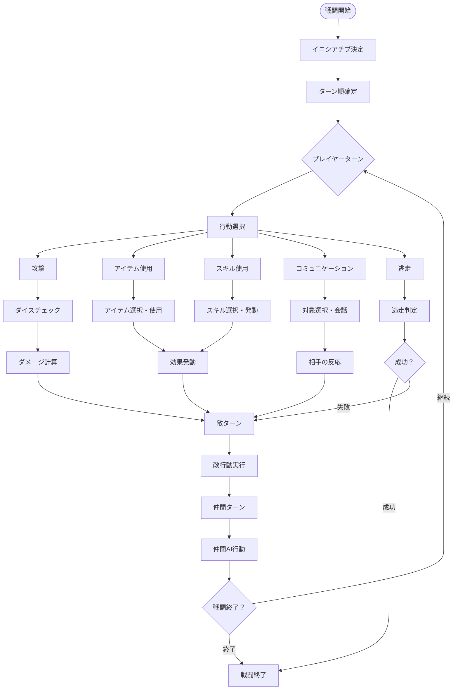
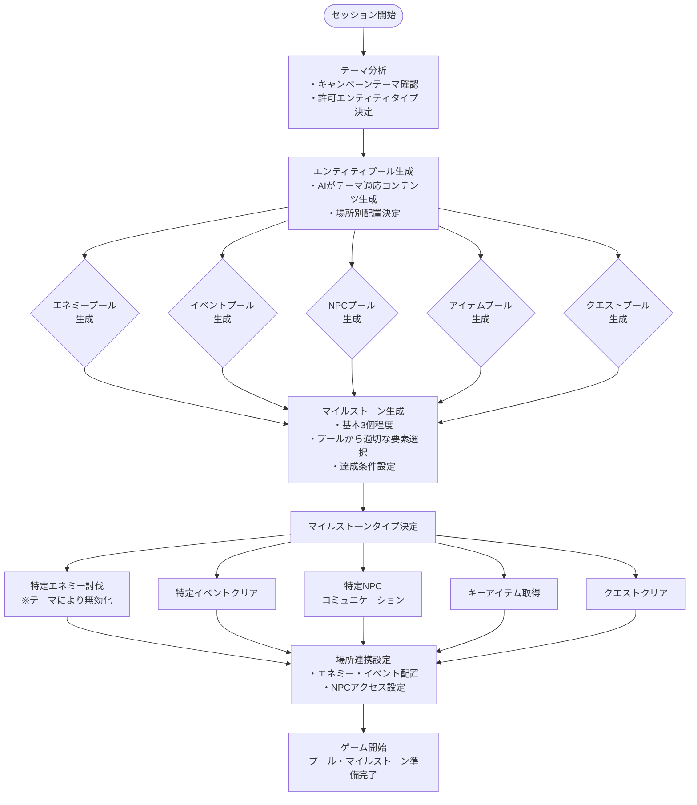
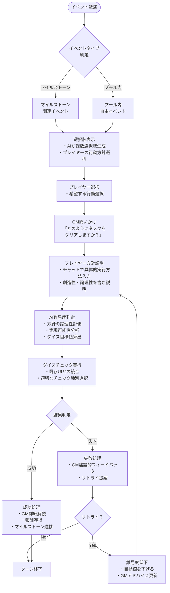
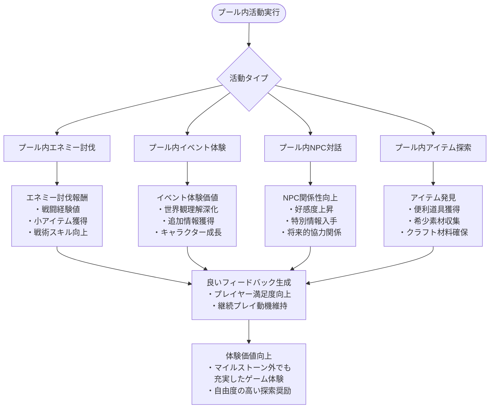
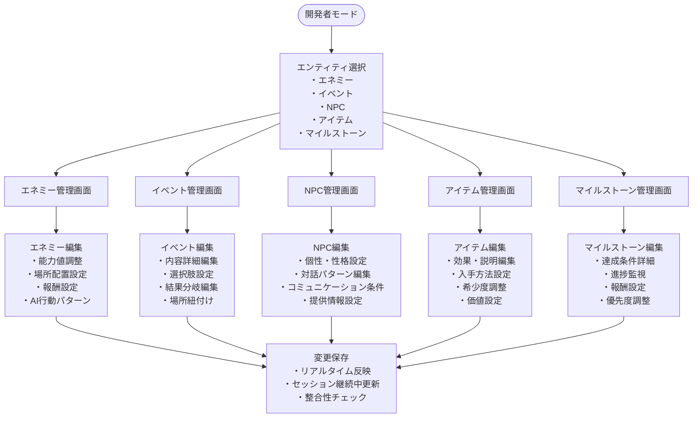

# TRPGセッション フロー

## 全体フロー図

## 詳細フロー説明

### 1. セッション開始フェーズ
1. **キャラクター選択**: プレイヤーが操作するキャラクターを選択
2. **セッション時間設定**: プレイ時間を選択
   - **短時間プレイ**: 3日間、1日3アクション、マイルストーン1個、約30分
     - 日単位分割: 朝・昼・夜（3つの時間帯）
   - **中時間プレイ**: 7日間、1日4アクション、マイルストーン3個、約70分
     - 日単位分割: 朝・昼・夕方・夜（4つの時間帯）
   - **長時間プレイ**: 11日間、1日4アクション、マイルストーン5個、約2時間
     - 日単位分割: 朝・昼・夕方・夜（4つの時間帯）
   - **カスタム**: 自由設定（1日3～4アクション選択可能、日単位分割数も選択可能）
3. **AIセッション開始**: 設定を確認して「セッション開始」ボタンをクリック
4. **プール・マイルストーン生成**: AIが以下をバッチ処理で生成
   - **エンティティプール生成**: テーマに適応したエネミー、イベント、NPC、アイテム、クエストプールを生成
   - **マイルストーン自動生成**: 基本3個程度のマイルストーンを以下のタイプから選択して生成
     - 特定のエネミーを倒す（テーマにより無効化：ほのぼの日常など）
     - 特定のイベントをクリア
     - 特定のNPCとの特定のコミュニケーションの実施
     - キーアイテムの取得
     - クエストクリア
   - **場所連携設定**: イベント・エネミーを適切な場所に配置
5. **ゲーム概要アナウンス**: AIゲームマスターが世界観とシナリオを説明

### 2. 行動選択フェーズ
プレイヤーは以下の行動から選択：

#### a. 探索行動
- **マイルストーン関連**: マイルストーンに設定されたイベント・エネミー・NPCとの遭遇
- **プール内探索**: プール内のエネミー討伐・イベント体験・NPCとの自由対話
- **場所別コンテンツ**: 現在地に配置されたイベント・エネミーの発見
- 調査、追跡、偵察などの行動

#### b. 拠点行動
- 拠点タブに設定された施設での行動
- 買い物、休息、情報収集など

#### c. 仲間との交流
- パーティメンバーとのコミュニケーション
- 相談、作戦会議など

#### d. クエスト実行
- クエスト管理画面から選択
- メインクエスト、サブクエストの進行

#### e. 場所移動
- 現在地から別の場所へ移動
- 固定1ターン消費

#### f. 戦闘
- 「探索」タブが「戦闘」タブに切り替わる
- 詳細は戦闘フロー参照

### 3. タスク実行フェーズ

#### 3.1 インタラクティブイベント実行フロー
1. **イベント選択肢表示**: AIが複数の行動選択肢を提示（何択か）
2. **選択肢選択**: プレイヤーが希望する行動を選択
3. **GMクリア方針問いかけ**: AIゲームマスターが「どのようにタスクをクリアしますか？」と質問
4. **クリア方針説明**: プレイヤーがチャットで具体的な実行方針を説明
5. **AI難易度判定**: プレイヤーの方針に基づきAIが難易度を算出
6. **ダイスチェック実行**: 既存のダイスチェックUIとの連携
7. **結果判定・GM解説**: 成功・失敗に応じたGMの詳細な結果説明

#### 3.2 リトライシステム
- **リトライ可能**: 失敗時は何度でもリトライ可能
- **段階的難易度低下**: リトライごとに難易度が下がる
- **フィードバック変化**: リトライ回数に応じたGMのアドバイス内容変化

#### 3.3 従来のタスク実行（非イベント）
1. **タスク内容説明**: AIがタスクの詳細を説明
2. **アプローチ決定**: プレイヤーがチャットでアプローチ方法を入力
3. **難易度判定**: AIがアプローチの論理性を評価し、難易度を調整

### 4. チェック実行フェーズ
アプローチに応じて適切なチェックを実行：

- **ダイスチェック**: 攻撃や一般的な判定
- **パワーチェック**: 力技での突破
- **スキルチェック**: 特定技能を使用した判定

### 5. 結果処理フェーズ

#### 5.1 マイルストーン関連活動の成功時
- **マイルストーン達成**: 対象マイルストーンの進捗更新・完了
- **キーアイテム獲得**: マイルストーン必須アイテムの入手
- **クリアフラグ設定**: 重要イベント・NPCコミュニケーション完了
- **経験値・報酬獲得**: マイルストーン価値に応じた大きな報酬

#### 5.2 プール内活動の成功時（マイルストーン外）
- **良いフィードバック提供**: マイルストーン進展はないが、プレイヤー体験を向上
- **サブ報酬獲得**: 小さなアイテム・経験値・情報の入手
- **NPCとの関係性向上**: 自由対話による好感度上昇
- **世界観の深掘り**: 追加の背景情報・ストーリー要素の発見

#### 5.3 失敗時の処理
- **難易度が低下してリトライ可能**: すべての活動でリトライ機能提供
- **建設的フィードバック**: 失敗理由の説明と改善提案
- **状況に応じたペナルティ**: 軽微なペナルティ（時間消費のみなど）

### 6. ターン管理・仲間自律行動
- 各行動で1ターン消費
- 1日あたりの行動回数制限あり（日単位分割システム）：
  - **短時間プレイ**: 1日3アクション（朝・昼・夜の3つの時間帯）
  - **中時間プレイ**: 1日4アクション（朝・昼・夕方・夜の4つの時間帯）
  - **長時間プレイ**: 1日4アクション（朝・昼・夕方・夜の4つの時間帯）
  - **カスタム**: 3～4アクション選択可能（日単位分割数も選択可能）
- **WebSocket仲間自律システム**の実行：

#### 6.1 サーバー側状況分析フェーズ
1. **行動結果分析**: プレイヤーの行動結果と現在状況を分析
2. **仲間反応判定**: 各仲間キャラクターが反応すべきかを判定
3. **個性別反応生成**: キャラクター性格に基づいたAI反応生成
4. **WebSocket配信**: 生成されたメッセージをリアルタイムでプッシュ

#### 6.2 リアルタイム配信フェーズ
1. **即時配信**: AI生成された仲間メッセージを即座にクライアントにプッシュ
2. **チャット統合**: WebSocketメッセージがチャットインターフェースに自動表示
3. **状況更新**: 仲間の行動に基づいて次のAI監視サイクル更新
4. **継続監視**: WebSocketを通じて継続的なセッション監視実行

#### 6.3 キャラクター職業別反応パターン
- **戦士**: 戦術的アドバイス、危険察知、仲間保護
- **魔法使い**: 知識提供、魔法的解決策、慎重な判断
- **盗賊**: 危険回避、効率的ルート、隠し要素発見

#### 6.4 状況適応システム
- **成功連続時**: 励まし、次の挑戦提案
- **失敗連続時**: 慰め、戦略変更提案
- **リスク高時**: 警告、安全策提案
- **探索長期化時**: 休息提案、モチベーション維持

### 7. ゲーム終了判定
最終日の最終ターンで以下を確認：
- キーアイテムの所持
- マイルストーンのクリア状況
- 特定イベントのクリアフラグ
- その他、キャンペーン設定で定義されたクリア条件

## WebSocket仲間自律行動システム（※1）

### WebSocketシステムの特徴

#### **リアルタイム応答メカニズム**
- **即時判定**: プレイヤー行動後、サーバー側で即座に反応判定
- **適切なタイミング**: 状況に応じた自然な反応タイミング
- **プッシュ配信**: WebSocketによる即時メッセージ配信
- **省エネ監視**: 必要時のみAI生成実行で効率的

#### **自然な会話流れ**
- **文脈保持**: セッション全体の文脈を踏まえた適切な反応
- **キャラクター一貫性**: 各仲間の性格・専門性を正確に反映
- **状況適応**: 現在の状況に最も適したキャラクターが発言
- **個性表現**: 戦士・魔法使い・盗賊の特色ある反応

#### **サーバー管理の利点**
- **集中管理**: セッション状態をサーバー側で一元管理
- **データ整合性**: WebSocketによる確実な状態同期
- **拡張性**: 新キャラクターや新機能の追加が容易
- **リアルタイム性**: 人間が操作しているような自然な反応速度

## 戦闘フロー（※2）

### 戦闘詳細
- **1ターンに1回行動**: 攻撃、アイテム使用、スキル使用、会話、逃走から選択
- **仲間の自律行動**: AIが状況に応じて最適な行動を選択
- **敵の行動**: 基本的にAIが制御、一部は事前設定された行動パターン

## NPC・エネミー配置
- **NPC**: 各拠点に配属（宿屋、道具屋、武器屋の店主など）
- **エネミー**: 
  - クエストで指定された固定配置
  - AIが自律的に動かすランダムエンカウント

## 特記事項

### 仲間自律行動システムの革新的特徴
- **WebSocket AI**: サーバー側で状況を判断し、リアルタイムで仲間が自然に反応
- **適応的発言**: 行動結果に応じて最も適切なキャラクターが適切なタイミングで発言
- **自然な会話**: AIエージェントが人間プレイヤーを代理操作している前提での自然な反応
- **個性表現**: 各キャラクターの職業・性格に応じた独自の反応パターン

### AIゲームマスターとの連携
- AIゲームマスターは常にプレイヤーの行動を監視し、適切な演出とフィードバックを提供
- 仲間システムとGMは独立して動作し、自然な多角的サポートを実現
- 難易度はプレイヤーのアプローチによって動的に調整される

### 技術的実装ポイント
- **WebSocket通信**: Socket.IOによる安定したリアルタイム通信
- **サーバー管理**: グローバルsocketService経由での統一的な仲間メッセージ管理
- **拡張性**: 新キャラクター・新反応パターンの追加が容易な設計
- **フォールト耐性**: WebSocket接続失敗時の適切なフォールバック機能

## マイルストーン・プールシステム詳細フロー

### マイルストーン生成システムフロー

### インタラクティブイベントシステムフロー

### プール内活動フィードバックシステム

### 開発者モード管理フロー

### テーマ適応システム

#### テーマ別制約・特徴

**ほのぼの日常テーマ**
- ✅ **有効**: イベント、NPC対話、アイテム獲得、クエスト
- ❌ **無効**: エネミー討伐マイルストーン
- 🎯 **特化**: 料理、手芸、農業、友情、地域貢献系イベント

**ホラーミステリーテーマ**
- ✅ **有効**: 全マイルストーンタイプ対応
- 🎯 **特化**: 謎解き、証拠収集、真犯人発見、呪い解除

**クラシックファンタジーテーマ**
- ✅ **有効**: 全マイルストーンタイプ対応
- 🎯 **特化**: 魔王討伐、伝説武器獲得、古代遺跡探索

**SF宇宙冒険テーマ**
- ✅ **有効**: 全マイルストーンタイプ対応（エネミー=エイリアン等）
- 🎯 **特化**: 未知技術獲得、惑星探索、宇宙戦争